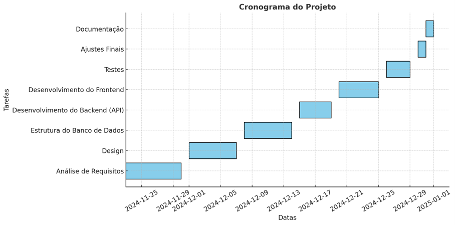

# PlanIT - Documentação da Aplicação


---

## Índice

- [Curso](#curso)
- [Elementos do Grupo](#elementos-do-grupo)
- [Professores](#professores)
- [Objetivos e Motivação](#objetivos-e-motivação)
- [Público-Alvo](#público-alvo)
- [Aplicações Semelhantes](#aplicações-semelhantes)
- [Caso de Utilização Principal](#caso-de-utilização-principal)
- [Casos de Utilização Secundários](#casos-de-utilização-secundários)
- [Descrição da Solução](#descrição-da-solução)
- [Project Charter](#project-charter)
- [MockUps](#mockups)
- [Planeamento (Gráfico de Gantt)](#planeamento-gráfico-de-gantt)
- [Conclusão](#conclusão)
- [Bibliografia](#bibliografia)
- [Personas](#personas)
- [Diagrama de Classes](#diagrama-de-classes)
- [Modelo Entidade-Relacionamento](#modelo-entidade-relacionamento)
- [Documentação da API REST](#documentação-da-api-rest)

---

## Curso

- **Engenharia Informática**

---

## Elementos do Grupo

- **Guilherme Simão - 50036457**

---

## Professores

- **Programação Mobile**: Nathan Campos
- **Projeto Desenvolvimento Móvel**: Pedro Rosa

---

## Objetivos e Motivação

### Objetivos

- Proporcionar uma ferramenta eficiente para gestão e organização de eventos pessoais.
- Implementar funcionalidades de geolocalização e envio de notificações em tempo real.
- Garantir uma interface intuitiva para maximizar a experiência do utilizador.

### Motivação

A crescente necessidade de organização em um mundo digital impulsionou a criação do PlanIT, uma solução que combina praticidade e tecnologia.

---

## Público-Alvo

- Estudantes universitários.
- Profissionais que necessitam de organização pessoal.
- Famílias que desejam coordenar eventos e compromissos.

---

## Aplicações Semelhantes

1. **Google Calendar** - Foco em organização de tarefas e compromissos.
2. **Trello** - Gestão de projetos e tarefas.
3. **Eventbrite** - Organização e promoção de eventos.

---

## Caso de Utilização Principal

- **Registar Evento:** O utilizador pode criar um novo evento inserindo título, descrição, data, hora e localização.

---

## Casos de Utilização Secundários

1. **Convidar Participantes:** O organizador pode convidar participantes para o evento.
2. **Editar Evento:** Permitir que o criador do evento atualize as informações.
3. **Gerir Participantes:** Visualizar e gerir confirmações de participantes.

---

## Descrição da Solução

### Arquitetura

- **Frontend:** Kotlin no Android Studio.
- **Backend:** Spring Boot.
- **Base de Dados:** MySQL.

---

## Project Charter

### General Project Information

- **Nome do Projeto:** PlanIT
- **Data de Início:** 10 de outubro de 2024
- **Data de Conclusão:** 12 de janeiro de 2025

### Project Details

- Desenvolvimento de uma aplicação para organização de eventos pessoais.

### Key Requirements

- Base de Dados: MySQL.
- API: REST desenvolvida com Spring Boot.
- UI/UX: Interface moderna e responsiva em Android jetpack compose.

### Expected Benefits

1. Organização simplificada.
2. Integração com serviços de localização.
3. Melhor produtividade dos utilizadores.

### Estimated Costs & Resources

- **Custo Estimado:** 3000€

### Estimated Milestones

1. **UI/UX Design:** Novembro 2024
2. **Backend:** Dezembro 2024
3. **Lançamento Beta:** Janeiro 2025

### Project Team

- Desenvolvedores:
  - Guilherme Simão

### Stakeholders

- Iade Creative University.

### Overall Project Risk

- **Risco:** Falta de tempo para implementar todas as funcionalidades desejadas.

### Project Success Criteria

- Aceitação pelo público-alvo.

---

## MockUps

Os mockups foram desenvolvidos para apresentar visualmente as telas principais do PlanIT. Seguem as principais telas:

[Mocks](Documents/Terceira_entrega/Mocks-PlanIT.pdf)

---

## Planeamento (Gráfico de Gantt)



---

## Conclusão

O PlanIT visa melhorar a gestão de eventos pessoais através de uma aplicação móvel intuitiva e eficiente. O projeto combina tecnologia moderna e necessidades do dia a dia.

---

## Bibliografia

- [Android Studio](https://developer.android.com)
- [Spring Boot](https://spring.io)
- [MySQL](https://www.mysql.com)
- [Google Calendar](https://calendar.google.com)
- [Eventbrite](https://www.eventbrite.com)
- [Figma](https://www.figma.com)
- [GitHub](https://github.com)
- [Postman](https://www.postman.com)

---

## Personas

### Persona 1

- **Nome:** João Pereira
- **Idade:** 28 anos
- **Profissão:** Analista de Sistemas
- **Localização:** Lisboa, Portugal
- **Status Familiar:** Solteiro

#### Perfil e Comportamento

João é um jovem dinâmico e focado no trabalho. Ele utiliza a tecnologia para se organizar e prioriza ferramentas que simplifiquem sua rotina. Além disso, gosta de participar de eventos culturais e profissionais para networking e crescimento pessoal.

#### Objetivos ao usar o app

- Organizar eventos de forma eficiente.
- Sincronizar compromissos com outras ferramentas de produtividade.
- Acompanhar confirmações de presença em tempo real.

#### Frustrações e Desafios

- Falta de notificações para atualizações de eventos.
- Dificuldade em coordenar grupos grandes de pessoas.

#### Motivações

- Melhorar a gestão do tempo.
- Participar de mais eventos que agreguem valor à sua carreira e vida pessoal.

---

### Persona 2

- **Nome:** Mariana Alves
- **Idade:** 32 anos
- **Profissão:** Professora de Educação Física
- **Localização:** Porto, Portugal
- **Status Familiar:** Casada, com dois filhos

#### Perfil e Comportamento

Mariana é organizada e valoriza ferramentas que otimizem a rotina de sua família. Ela gosta de planejar eventos com antecedência e prioriza aplicativos que sejam fáceis de usar e seguros para compartilhar informações com amigos e familiares.

#### Objetivos ao usar o app

- Planejar eventos familiares e sociais.
- Receber lembretes sobre compromissos importantes.
- Compartilhar informações de eventos com facilidade.

#### Frustrações e Desafios

- Ferramentas complicadas que dificultam o planejamento.
- Falta de recursos para gerenciar alterações de última hora.

#### Motivações

- Proporcionar momentos de qualidade com a família.
- Aumentar a eficiência na organização de tarefas e eventos.

---

## Diagrama de Classes


O diagrama de classes foi criado para representar a estrutura de classes do backend da aplicação. Ele demonstra as principais entidades do sistema, como `User`, `Event`, `Location` e `Participant`, e como elas se relacionam.

Com este diagrama, fica clara a estrutura do sistema e sua relação com a lógica de negócio, permitindo uma compreensão detalhada para desenvolvedores e stakeholders.

---

## Modelo Entidade-Relacionamento

O modelo de entidade-relacionamento é fundamental para estruturar a base de dados do PlanIT. Ele inclui as principais entidades, como `User`, `Event`, `Location`, e `Participant`, e seus relacionamentos.

O relacionamento com o utilizador (User) é central no modelo. Cada utilizador pode criar ou participar de diferentes eventos (Event), registrando assim suas interações e atividades. Os eventos estão associados a localizações específicas (Location), que permitem organizar os dados de forma geográfica. Além disso, os participantes (Participant) registram o status de cada pessoa em relação ao evento, como "confirmado", "pendente" ou "recusado".

Com este modelo, o PlanIT assegura uma gestão eficiente dos dados, permitindo a fácil recuperação e análise das informações para aprimorar a experiência do utilizador.

## Documentos de referência  

[Guia de dados](docs/descrição-do-modelo-de-dados.pdf) 

---

## Documentação da API REST

### Introdução

A API REST do PlanIT fornece acesso a funcionalidades essenciais para a gestão de eventos, participantes, localizações e utilizadores. Os endpoints estão estruturados para permitir operações de criação, leitura, atualização e exclusão (CRUD), com respostas consistentes em JSON.

### Endpoints Principais

#### User Controller

1. **Adicionar Utilizador**
   - **Método:** POST
   - **Endpoint:** `/user/add`
   - **Descrição:** Regista um novo utilizador.

   **Exemplo de Corpo da Requisição:**
   ```json
   {
     "name": "João Silva",
     "email": "joao.silva@gmail.com",
     "password": "senha123"
   }
   ```

   **Resposta de Sucesso:**
   ```json
   {
     "message": "Utilizador adicionado com sucesso"
   }
   ```

   **Resposta de Erro:**
   ```json
   {
     "status": 400,
     "message": "Erro ao adicionar utilizador"
   }
   ```

2. **Listar Utilizadores**
   - **Método:** GET
   - **Endpoint:** `/user`
   - **Descrição:** Obtém a lista de todos os utilizadores.

   **Resposta de Sucesso:**
   ```json
   [
     {
       "id": 1,
       "name": "João Silva",
       "email": "joao.silva@gmail.com"
     }
   ]
   ```

3. **Login**
   - **Método:** POST
   - **Endpoint:** `/user/login`
   - **Descrição:** Autentica um utilizador.

   **Exemplo de Corpo da Requisição:**
   ```json
   {
     "email": "joao.silva@gmail.com",
     "password": "senha123"
   }
   ```

   **Resposta de Sucesso:**
   ```json
   {
     "id": 1,
     "name": "João Silva",
     "email": "joao.silva@gmail.com"
   }
   ```

   **Resposta de Erro:**
   ```json
   {
     "status": 401,
     "message": "Credenciais inválidas"
   }
   ```

#### Event Controller

1. **Adicionar Evento**
   - **Método:** POST
   - **Endpoint:** `/event/add`
   - **Descrição:** Cria um novo evento.

   **Exemplo de Corpo da Requisição:**
   ```json
   {
     "title": "Reunião de Equipa",
     "description": "Discussão do projeto.",
     "date": "2025-01-15T15:00:00",
     "userId": 1
   }
   ```

   **Resposta de Sucesso:**
   ```json
   {
     "message": "Evento criado com sucesso"
   }
   ```

   **Resposta de Erro:**
   ```json
   {
     "status": 400,
     "message": "Erro ao criar evento"
   }
   ```

2. **Obter Eventos por Utilizador**
   - **Método:** GET
   - **Endpoint:** `/event/user/{userId}`
   - **Descrição:** Lista eventos associados a um utilizador.

   **Resposta de Sucesso:**
   ```json
   [
     {
       "id": 1,
       "title": "Reunião de Equipa",
       "description": "Discussão do projeto."
     }
   ]
   ```

3. **Pesquisar Eventos**
   - **Método:** GET
   - **Endpoint:** `/event/search`
   - **Descrição:** Permite buscar eventos com base em título, descrição ou data.

4. **Eliminar Evento**
   - **Método:** DELETE
   - **Endpoint:** `/event/delete/{eventId}`
   - **Descrição:** Remove um evento pelo ID.

#### Location Controller

1. **Adicionar Localização**
   - **Método:** POST
   - **Endpoint:** `/location/add`
   - **Descrição:** Adiciona uma nova localização.

2. **Listar Localizações**
   - **Método:** GET
   - **Endpoint:** `/location/all`
   - **Descrição:** Lista todas as localizações disponíveis.

#### Participant Controller

1. **Adicionar Participante**
   - **Método:** POST
   - **Endpoint:** `/participant/add`
   - **Descrição:** Adiciona um participante a um evento.

2. **Gerir Estado do Participante**
   - **Método:** PATCH
   - **Endpoint:** `/participant/{participantId}/status`
   - **Descrição:** Atualiza o estado de um participante.

---

### Exemplo de Resposta JSON

#### Evento

```json
{
  "id": 1,
  "title": "Reunião de Equipa",
  "description": "Discussão sobre o projeto.",
  "date": "2025-01-12T15:00:00",
  "location": {
    "id": 10,
    "address": "Rua Principal, 123",
    "latitude": 40.7128,
    "longitude": -74.0060
  },
  "participants": [
    {
      "id": 5,
      "userId": 2,
      "userName": "Joana Silva",
      "status": "CONFIRMED"
    }
  ]
}
```
[Documentação da API](docs/planit_api_documentation.pdf)
